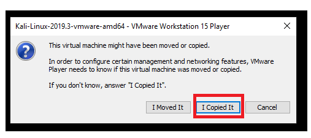

# Kali Linux on VM Ware - Windows

1. Navigate here: https://www.offensive-security.com/kali-linux-vm-vmware-virtualbox-image-download/

2. Download the image file you want, depending on if your using 32 or 64 bit, or VMWare or Virutal Box (this writup will specify VM Ware).

3. You will need 7Zip (or WinRAR) to extract the file, if you don't have it already. You can download it from here: https://www.7-zip.org/download.html

4. I would recommend creating a new folder on your hard drive for Virtual Machines. Move your newly downloaded file to that location. 

5. Right click on the file, select 7-Zip, and then **Extract Here**. 

6. **PRO TIP** Keep the compressed (7Zip) file just incase you need to setup you VM again later, rather than downloading it again.

7. If you haven't already, download VMWare Workstation Player: https://www.vmware.com/products/workstation-player.html

8. Open up **VMWare Workstation Player**.

9. Click on **Open a Virtual Machine**

10. Navigate to where you extracted the VM, select it, and then click on **Open**.

11. If successful you should see it load. Click on **Play**.

12. When prompted select **I Copied It**

13. It will take a few minutes for you VM to load. If successful, you should see the login page.

14. Congrats! You got you VM working.
