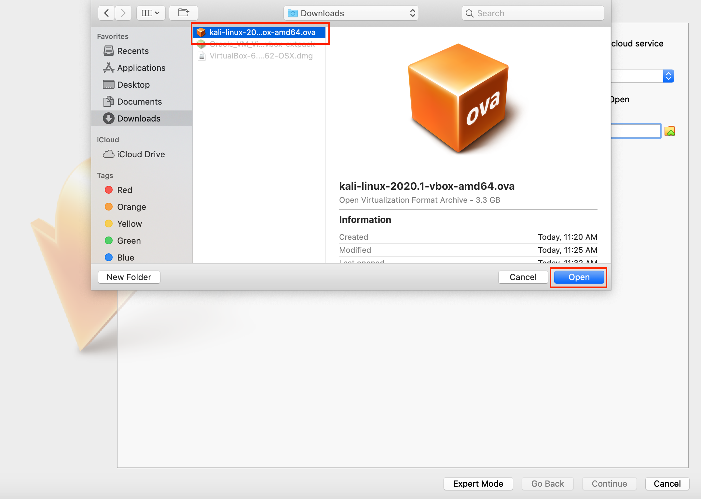
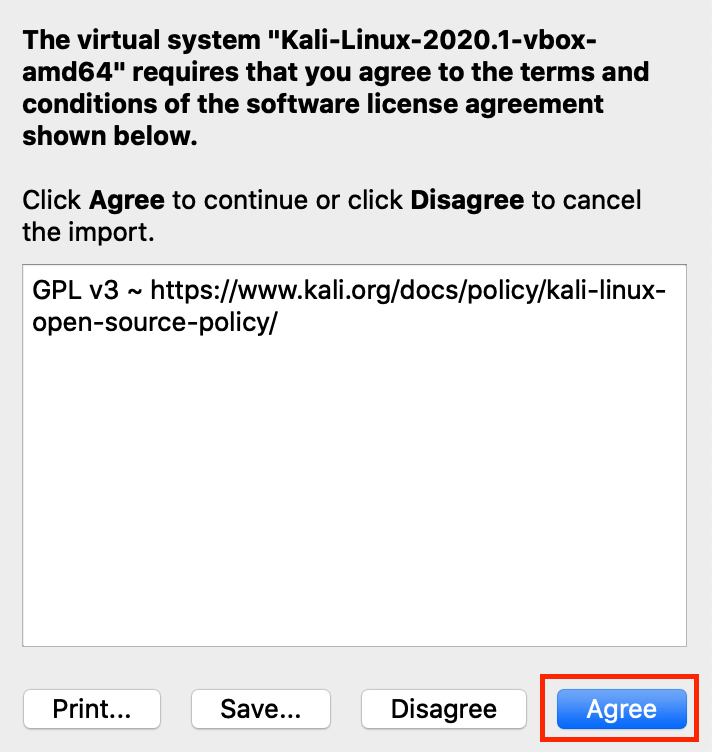
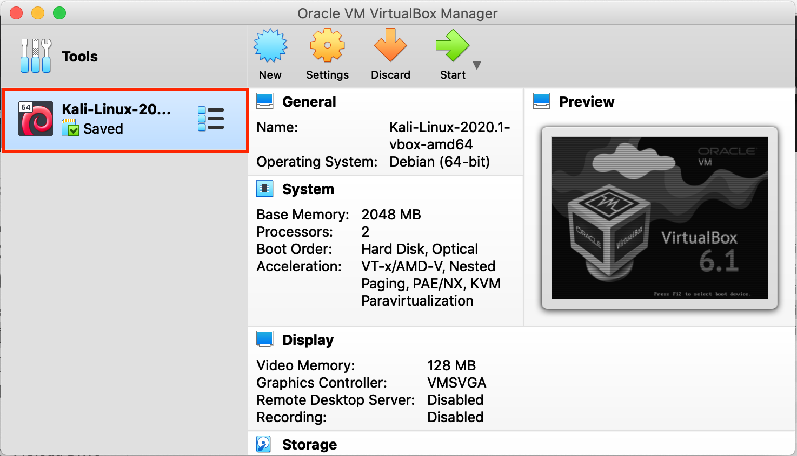

# Kali Linux on VirtualBox - Mac

1. Navigate here: https://www.offensive-security.com/kali-linux-vm-vmware-virtualbox-image-download/

2. Download the image file you want, depending on if your using 32 or 64 bit, or VMWare or VirutalBox (this writup will specify VirtualBox).

3. I would recommend creating a new folder on your hard drive for Virtual Machines. Move your newly downloaded file to that location. 

4. If you haven't already, download VirtualBox: https://www.virtualbox.org/wiki/Downloads

5. Open up **VirtualBox**.

6. Click on **Import**

7. Navigate to where you extracted the VM, select it, and then click on **Open**. 

8. You will see the file path of the Kali download after **File**. Click on **Continue**. Click **Import**. 

9. Click **Agree**.

10. If successful you should see it load. Double click on the instance.

11. You may receive a USB error saying that you need to "Download a VirtualBox Extension Pack". If so, please download the Extension pack located here: https://www.virtualbox.org/wiki/Downloads

12. It will take a few minutes for you VM to load. If successful, you should see the login page. Use Username: kali Password: kali

13. Congrats! You got your VM working.
