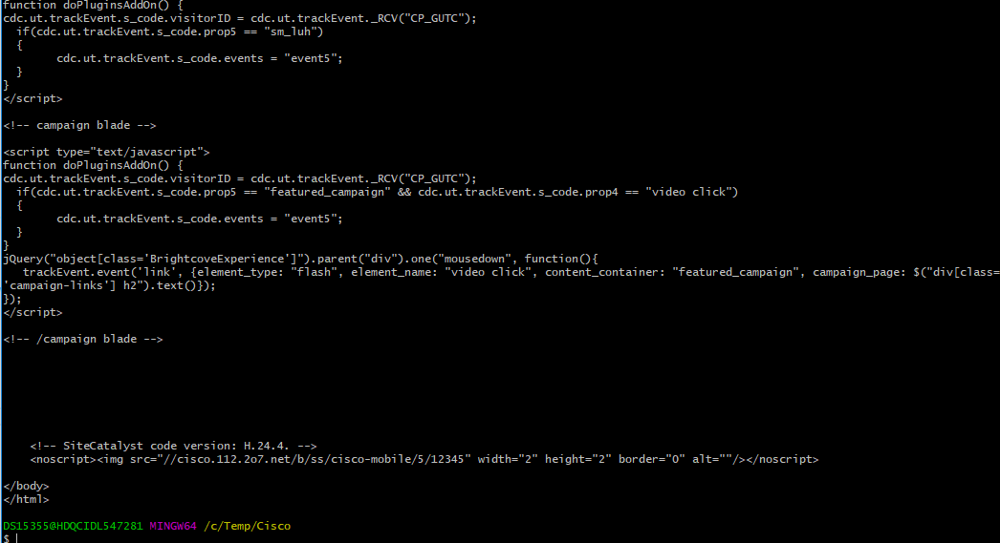

## Using Command Line

This should be some from a Linux based machine, like Kali or Ubuntu. 

For this exercise, let's say your Manager has asked you to identify every single unique URL off of a website. For this example, we're going to use **www.cisco.com**. After you have every URL, they want the IP addresses associated with those URL's.

Now, you could right click on the web page and view the source code (demonstrait this). But pulling out each URL could be time consuming, and if you're working in an incident response situation you may only have a few minutes to quickly identify the target URL's. This is when something like the command line can come in handy. 

1. Start by bringing up a terminal window and then navigating to the Documents directory.

2. Create a new directory called Cisco with the command `mkdir Cisco` and then move into that directory with `cd Cisco`

3. Now let's get the index file from www.cisco.com using **wget www.cisco.com**
    - Wget is used to download files from the web via the command line. It is extremely useful for Linux activities, including penetration testing. For now, we'll use it to download the index.html file from cisco.com
    

4. Next, do **cat index.html** to go through it. We're looking for links. Be sure to point them out.


5. Ask the class how do you identify a link in a html document. There are several ways to do it but the most reliable is looking for **href=** within the document.


6. Ask the students what command did we recently use to search through plain text files for a value or expression? **Grep**.


7. So now let's grep out those lines from index.html that contain links with the following command. Remind students that we need to use a pipe `|` to combine the commands. The pipe takes the output from the command to the left of it and use it as input on the command to the right: `cat index.html | grep "href="` 


8. Things still look kinda messy, though. We need to get rid of the .html stuff. So let's use the **cut** command and see if we can clean it up. Slack out the followng link to the students.
    - https://www.geeksforgeeks.org/cut-command-linux-examples/

9. When using a new command, we should check **TWO THINGS FIRST**. The **HELP** file and the **MAN** page. Demonstrate the following two commands. 
    - `cut --help`
    - `man cut`

10. Have the students look through `cut --help` and see if there's an option that might help us break this data up. A special character perhaps?

11. We're going to want to cut with a delimiter. And a delimiter is one or more characters that separate text strings. They include `, ; " ' / \` and others.
    - https://www.computerhope.com/jargon/d/delimite.htm

12. Talk about how Excel is frequenly used to seperate out data in something like a spreadsheet. Often times, we use a comma `,` in Comma Seperated Value, or CSV, files.

13. Looking at our previous command with grep, ask te students what character they could use to delimite, or seperate out, the data? We're looking for the **/**

14. Run the following command: `cat index.html | grep "href=" |cut -d "/"` and you'll get an error, we need to specify do we wanna cut bytes, characters, or fields.

  


15. Ask the students which option might make the most sense. We're going to be using **fields**. So let's try the first field. 

16. If we run the command `cat index.html | grep "href=" | cut -d "/" -f1` We'll get the first field, which is everything to the left of the first `/` in the line.


17. If we compare this with our previous command (without the cut) we can see the highlighted stuff below was excluded. 


18. That's not showing what we want, so let's change our field to `-f2` we get the 2nd field. Which is everything between the first field and the next (third) field.


19. That's still not what we want, let's change it to `-f3` we get what we're looking for. 


20. It looks better, we got rid of all the leading HTML, but we're not there yet. So let's break it down into just the **.com's** with another **grep**
    - `cat index.html | grep "href=" | cut -d "/" -f3 | grep "\.com"`

    - We use `\` as an escape character in Bash. Escape characters are used to remove the special meaning from a single character. A non-quoted backslash, `\`, is used as an escape character in Bash. It preserves the literal value of the next character that follows, the `.` in this case.

    


21. Now, there's some random quotes at the end of the lines, or just some extra data after the URL, so let's get rid of those by updating our command. Ask the students which command did we already use to cut data? **Cut**.

22. Ask the students if they can figure out how to update their command to something like the following:  `cat index.html | grep "href=" | cut -d "/" -f3 | grep "\.com" | cut -d '"' -f1`
    - Single quote, double quote, single quote

    

23. Let's work on getting rid of the duplicates. We can use the **sort** command. Have the students check out the help file for this command first and see if they can identify how to filger out the **unique** entries. 
    * `sort --help`
    * The command we want is `sort -u`

24. Thus, our updated command is `cat index.html | grep "href=" | cut -d "/" -f3 | grep "\.com" | cut -d '"' -f1 | sort -u` 

  

25. How do we send this data to a new file? We use it with the **>** to send the data to a text file. `cat index.html | grep "href=" | cut -d "/" -f3 | grep "\.com" | cut -d '"' -f1 | sort -u > cisco.txt`
  

## From URLs to IPs

15. We're almost there! We still have to get the IP adresses, so let's create a bash script. But first, we need to see what the output looks like when we use the **host** command: `host www.cisco.com`

16. Based on our newfound knowledge of delimiters and the **cut** command, can we use a combination of tools to isolate the IP address? Perhaps `grep "has address" | cut -d " " -f4`

17. Now, let's write a short bash script. `nano cisco.sh`

18. It should look like this:
    ```
    #!/bin/bash

    for url in $(cat cisco.txt);do
    host $url | grep "has address" | cut -d " " -f4
    done
    ```

You can also do this: `for url in $(cat domains.txt); do host $url | grep "has address" | cut -d " " -f4; done`


19. After we save it, we have to modify the permissions using `chmod 755 cisco.sh`

20. And finally, execute it with `./cisco.sh`

21. Next, for further usage for GREP, grep the ips.txt and use the `grep "^130."` expression. 

